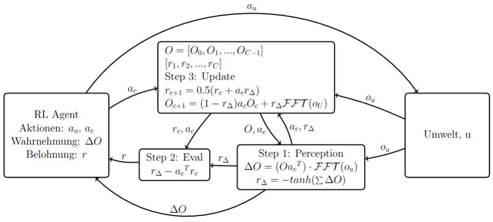

# Self evaluating estimator (SEE)

## Info

This project is intended to serve as a mindgame and does not aim to be a useful architecture in a practical way.

## Ideas

1. Build a system which can compute rewards for an reinforcement learning agent based on the differences between past observations and the current observation.
2. The agent shall observe only the difference between a self chosen observation from its memory and the observation from the environment.
3. Optimize observation selection and the policy function such that the two goals complement and self regulate each other.

## Run the gui

`poetry run python src/agents/main.py`